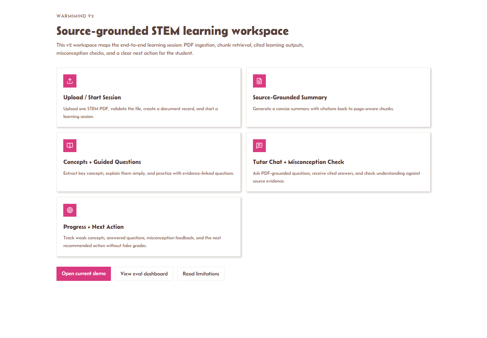

# WarmiMIND

Source-grounded AI STEM learning workspace for turning one uploaded PDF into a structured study session.

WarmiMIND's current v2 MVP ingests a text-based STEM PDF, creates page-aware source chunks, and uses deterministic retrieval/generation logic to produce cited summaries, concepts, guided questions, tutor chat, misconception feedback, learning state, next recommended actions, and evaluation metrics.

## How to Review This Repo

Start with the current audit and product contract:

- [Project audit guide](docs/project-audit.md)
- [Project audit upgrade PRD](.github/PRDs/project-audit-upgrade-prd.md)
- [Architecture](docs/architecture.md)
- [Methodology](docs/methodology.md)
- [Limitations](docs/limitations.md)
- [Deployment readiness](docs/deployment.md)
- [Demo script](docs/demo-script.md)
- [Screenshots](docs/screenshots/README.md)
- [Evaluation fixture notes](evals/README.md)
- [FastAPI docs](api/README.md)
- [Migration notes](migrations/README.md)
- [ADRs](docs/adr)

Recommended local validation:

```bash
pnpm review:smoke
py -m compileall api
pnpm test
pnpm lint
pnpm exec tsc --noEmit --pretty false
pnpm build
pnpm audit --audit-level low
```

The review path does not require provider credentials or Supabase access when `REPOSITORY_BACKEND=memory`.

## Current Status

- Visible v2 upload and workspace flow is implemented at `/landing`.
- FastAPI v2 backend handles PDF validation, ingestion, retrieval, learning outputs, chat, misconception checks, progress state, and evals.
- Default storage is in-memory for local validation.
- Optional Supabase repository mode can persist app data and raw PDF bytes.
- Signed PDF URLs are disabled by default and require explicit configuration.
- Legacy Next.js AI and translation routes remain in the repo, but the recommended demo path is FastAPI v2.
- Core user flows have been smoke-tested with Playwright in development and production builds.

## Highlights

- Upload one STEM PDF and start a learning session.
- Inspect source chunks generated from the document.
- Generate source-grounded summaries, key concepts, and guided questions.
- Ask tutor-chat questions that cite evidence or refuse weakly supported answers.
- Run misconception checks and update weak-concept learning state.
- View next recommended learning actions.
- Track seeded eval metrics for retrieval, citation coverage, refusal behavior, question quality, and latency.
- Use optional Supabase Postgres and Storage persistence for the v2 backend.

## Screenshots



Additional review screenshots:

- [Evaluation dashboard](docs/screenshots/evals.png)
- [Methodology and limitations](docs/screenshots/about.png)

## Tech Stack

| Area | Stack |
| --- | --- |
| Frontend | Next.js, React, TypeScript, Tailwind CSS |
| UI | shadcn/ui-style components, Lucide React icons |
| Backend | FastAPI, Python |
| PDF processing | `pypdf` for text-based PDFs |
| Current retrieval/generation | Deterministic service logic for repeatable local validation |
| Optional persistence | Supabase Postgres, Supabase Storage |
| Planned vector layer | pgvector-backed semantic retrieval |
| Legacy AI utilities | Google Gemini through AI SDK, Google Cloud Translation |

## Quick Start

### Prerequisites

- Node.js 18+
- pnpm
- Python 3.11+

### Install

```bash
pnpm install
```

### Configure Environment

Create `.env.local`:

```env
GOOGLE_CLOUD_PROJECT_ID=your-project-id
GOOGLE_GENERATIVE_AI_API_KEY=your-google-ai-key
NEXT_PUBLIC_APP_URL=http://localhost:3000
NEXT_PUBLIC_API_BASE_URL=http://localhost:8000
REPOSITORY_BACKEND=memory
SUPABASE_URL=
SUPABASE_SERVICE_ROLE_KEY=
SUPABASE_PDF_BUCKET=warmimind-pdfs
SIGNED_URL_TTL_SECONDS=300
ENABLE_PDF_SIGNED_URLS=false
```


Use `REPOSITORY_BACKEND=memory` for local validation and tests. Use `REPOSITORY_BACKEND=supabase` with `SUPABASE_URL`, a server-only `SUPABASE_SERVICE_ROLE_KEY`, and `SUPABASE_PDF_BUCKET` to persist v2 app data and uploaded PDF bytes.

Keep `ENABLE_PDF_SIGNED_URLS=false` unless authenticated ownership and retention policies have been reviewed for the deployment.

### Run Locally

Start the FastAPI backend:

```bash
cd api
python -m pip install -r requirements.txt
uvicorn app.main:app --reload
```

In another shell, start Next.js:

```bash
pnpm dev
```

Open `http://localhost:3000`.

## Commands

| Command | Description |
| --- | --- |
| `pnpm dev` | Start the Next.js dev server with webpack |
| `pnpm build` | Build the Next.js app with webpack |
| `pnpm start` | Start the production Next.js server |
| `pnpm lint` | Run ESLint |
| `pnpm exec tsc --noEmit` | Run TypeScript checks |
| `pnpm test` | Run FastAPI unit tests |
| `pnpm review:smoke` | Verify review-critical docs, files, routes, and contract references |
| `pnpm audit --audit-level low` | Check dependency advisories |
| `py -m compileall api` | Compile-check Python backend files |

## Recommended Demo Flow

1. Open `/landing`.
2. Upload a text-based STEM PDF.
3. Review the generated workspace.
4. Inspect source chunks.
5. Read the cited summary and key concepts.
6. Answer guided questions and a misconception check.
7. Ask tutor-chat questions, including one unsupported question to confirm refusal behavior.
8. Review progress state and next recommended action.
9. Open `/evals` and run the seeded evaluation dashboard.

## Main Routes

| Route | Purpose |
| --- | --- |
| `/` | Recommended entry point |
| `/landing` | Visible v2 PDF upload and learning demo |
| `/workspace` | v2 workspace overview and review surface |
| `/evals` | Evaluation dashboard |
| `/about` | Methodology and limitations |

## FastAPI v2 Endpoints

The visible demo uses `/api/v1` endpoints from the FastAPI backend:

| Endpoint | Purpose |
| --- | --- |
| `GET /health` | Backend health check |
| `GET /api/v1/health` | Versioned backend health check |
| `POST /api/v1/documents` | Validate, ingest, and chunk a PDF |
| `GET /api/v1/documents/{document_id}` | Fetch document metadata and chunks |
| `GET /api/v1/documents/{document_id}/signed-url` | Return a signed PDF URL only when explicitly enabled |
| `POST /api/v1/learning-sessions` | Create a learning session |
| `GET /api/v1/learning-sessions/{session_id}` | Fetch session state |
| `POST /api/v1/learning-sessions/{session_id}/retrieve` | Retrieve relevant source chunks |
| `POST /api/v1/learning-sessions/{session_id}/summary` | Generate a cited summary |
| `POST /api/v1/learning-sessions/{session_id}/concepts` | Generate key concepts |
| `POST /api/v1/learning-sessions/{session_id}/questions` | Generate guided questions |
| `POST /api/v1/learning-sessions/{session_id}/chat` | Answer with citations or refuse unsupported questions |
| `POST /api/v1/learning-sessions/{session_id}/misconception-checks` | Score misconception checks and update learning state |
| `POST /api/v1/evals/runs` | Run seeded evals |
| `GET /api/v1/evals/runs` | List eval runs |
| `GET /api/v1/evals/runs/{run_id}` | Fetch one eval run |

## Project Structure

```text
app/
  page.tsx              Recommended entry point
  landing/              Visible v2 upload and learning flow
  workspace/            v2 workspace map and review surface
  evals/                Evaluation dashboard
  about/                Methodology and limitations page
  api/
    process/            Legacy text-processing route
    chat/               Legacy chat route
    translate/          Legacy translation helper endpoint
components/             UI panels, PDF viewer, chat, and shared controls
lib/                    AI model setup, translation, retrieval, session helpers
api/                    FastAPI v2 backend
migrations/             Supabase schema and access-control posture migrations
evals/                  Seeded evaluation fixture
docs/                   Architecture, deployment, limitations, ADRs, screenshots
```

## Validation

Recent validation for the v2 MVP includes:

```bash
py -m compileall api
pnpm review:smoke
pnpm test
pnpm lint
pnpm exec tsc --noEmit --pretty false
pnpm build
pnpm audit --audit-level low
```

The visible upload, workspace, tutor chat, misconception, progress, eval, and default-disabled signed URL flows have also been validated with Playwright smoke tests.
